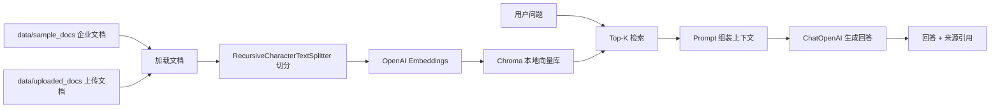

# 企业知识库 RAG 助手

这是一个可运行的 RAG Demo 项目，使用 Streamlit、LangChain、OpenAI API 和 Chroma 构建企业知识库问答助手。项目参考 LangChain 的检索增强生成思路：先把企业文档切分并写入向量库，再根据用户问题检索相关片段，最后让大模型基于检索内容生成带来源的回答。

## 项目亮点

- 内置企业知识库示例，开箱即可演示 HR 制度、产品说明和入职指南问答。
- 支持在页面上传 `.txt`、`.md`、`.pdf` 文档，并保存到本地上传目录后重建索引。
- 使用 LangChain 组织文档加载、文本切分、向量检索、Prompt 和 Chat Model 调用。
- 使用 Chroma 本地持久化向量索引，支持首次提问自动建库和手动重建索引。
- Streamlit Web 页面提供示例问题、Top-K 检索参数、回答展示和来源片段展开。
- Prompt 明确要求资料不足时回答不知道，降低无来源编造的风险。

## 架构



## 学习导读

建议按下面顺序阅读代码：

1. `src/rag/config.py`：了解项目如何读取 `.env`、模型名称、切分参数、上传目录和向量库目录。
2. `src/rag/loaders.py`：学习如何把 Markdown/TXT/PDF 文档加载成 Document，并保留来源元数据。
3. `src/rag/index.py`：学习如何切分文档、生成 Embedding，并把向量写入 Chroma。
4. `src/rag/chain.py`：学习一次提问如何经过 Top-K 检索、Prompt 组装和 ChatOpenAI 生成回答。
5. `src/rag/prompts.py`：学习如何约束模型只基于资料回答，资料不足时明确说明不知道。
6. `app.py`：学习 Streamlit 页面如何调用后端 RAG 模块，并把答案和来源展示给用户。

RAG 的核心不是“让大模型知道更多”，而是“每次回答前先找到可信资料，再让模型基于资料组织答案”。本项目把这条链路拆成独立模块，方便逐步调试和替换。

## 快速开始

1. 创建虚拟环境并安装依赖：

```bash
python3 -m venv .venv
source .venv/bin/activate
pip install -r requirements.txt
```

2. 配置 OpenAI API Key：

```bash
cp .env.example .env
```

编辑 `.env`，填入你的 `OPENAI_API_KEY`。

3. 启动 Web 应用：

```bash
streamlit run app.py
```

打开 Streamlit 给出的本地地址后，可以点击示例问题或直接输入问题。首次提问会自动构建 `vectorstore/` 本地索引，也可以在侧边栏点击“重建知识库索引”。

4. 上传自己的知识库文档：

在侧边栏“上传知识库”区域选择 `.txt`、`.md` 或 `.pdf` 文件，点击“保存上传并重建索引”。上传文件会保存到 `data/uploaded_docs/`，该目录默认不会被提交到 Git。

## 示例问题

- 新员工入职前需要准备什么？
- InsightFlow Enterprise 支持哪些知识库能力？
- 年假申请需要提前多久提交？

## 目录说明

```text
.
├── app.py                  # Streamlit Web 入口
├── data/sample_docs/       # 内置企业知识库示例文档
├── data/uploaded_docs/     # 运行时上传文档目录
├── docs/                   # 学习说明和 RAG 流程注释
├── src/rag/                # RAG 配置、加载、索引、链路和 Prompt
├── tests/                  # 无需真实 API Key 的基础测试
├── .env.example            # 环境变量模板
└── requirements.txt        # 运行依赖
```

## Docker 部署

构建镜像：

```bash
docker build -t enterprise-rag-assistant .
```

运行容器：

```bash
docker run --rm -p 8501:8501 \
  -e OPENAI_API_KEY=你的 OpenAI API Key \
  enterprise-rag-assistant
```

如果希望保留上传文档和 Chroma 索引，可以挂载本地目录：

```bash
docker run --rm -p 8501:8501 \
  -e OPENAI_API_KEY=你的 OpenAI API Key \
  -v $(pwd)/data/uploaded_docs:/app/data/uploaded_docs \
  -v $(pwd)/vectorstore:/app/vectorstore \
  enterprise-rag-assistant
```

更完整的部署说明见 `docs/DEPLOYMENT.md`。

## 测试

```bash
python3 -m pytest
```

当前测试覆盖：

- 示例文档可以加载。
- 文档切分后保留 `source` 元数据和 `chunk_id`。
- Prompt 包含资料不足时说明不知道、不要编造的约束。

## 扩展方向

- 增加 DOCX、网页抓取等数据加载器。
- 接入企业 SSO 和文档权限系统，实现按用户权限检索。
- 增加离线评测集，跟踪命中率、引用准确率和回答忠实度。
- 将 Streamlit Demo 拆分为 FastAPI 服务和独立前端，方便生产化部署。
