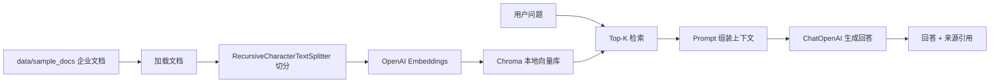

# 企业知识库 RAG 助手

这是一个可运行的 RAG Demo 项目，使用 Streamlit、LangChain、OpenAI API 和 Chroma 构建企业知识库问答助手。项目参考 LangChain 的检索增强生成思路：先把企业文档切分并写入向量库，再根据用户问题检索相关片段，最后让大模型基于检索内容生成带来源的回答。

## 项目亮点

- 内置企业知识库示例，开箱即可演示 HR 制度、产品说明和入职指南问答。
- 使用 LangChain 组织文档加载、文本切分、向量检索、Prompt 和 Chat Model 调用。
- 使用 Chroma 本地持久化向量索引，支持首次提问自动建库和手动重建索引。
- Streamlit Web 页面提供示例问题、Top-K 检索参数、回答展示和来源片段展开。
- Prompt 明确要求资料不足时回答不知道，降低无来源编造的风险。

## 架构



## 快速开始

1. 创建虚拟环境并安装依赖：

```bash
python3 -m venv .venv
source .venv/bin/activate
pip install -r requirements.txt
```

2. 配置 OpenAI API Key：

```bash
cp .env.example .env
```

编辑 `.env`，填入你的 `OPENAI_API_KEY`。

3. 启动 Web 应用：

```bash
streamlit run app.py
```

打开 Streamlit 给出的本地地址后，可以点击示例问题或直接输入问题。首次提问会自动构建 `vectorstore/` 本地索引，也可以在侧边栏点击“重建知识库索引”。

## 示例问题

- 新员工入职前需要准备什么？
- InsightFlow Enterprise 支持哪些知识库能力？
- 年假申请需要提前多久提交？

## 目录说明

```text
.
├── app.py                  # Streamlit Web 入口
├── data/sample_docs/       # 内置企业知识库示例文档
├── src/rag/                # RAG 配置、加载、索引、链路和 Prompt
├── tests/                  # 无需真实 API Key 的基础测试
├── .env.example            # 环境变量模板
└── requirements.txt        # 运行依赖
```

## 测试

```bash
python3 -m pytest
```

当前测试覆盖：

- 示例文档可以加载。
- 文档切分后保留 `source` 元数据和 `chunk_id`。
- Prompt 包含资料不足时说明不知道、不要编造的约束。

## 扩展方向

- 增加 PDF、DOCX、网页抓取等数据加载器。
- 接入企业 SSO 和文档权限系统，实现按用户权限检索。
- 增加离线评测集，跟踪命中率、引用准确率和回答忠实度。
- 将 Streamlit Demo 拆分为 FastAPI 服务和独立前端，方便生产化部署。

